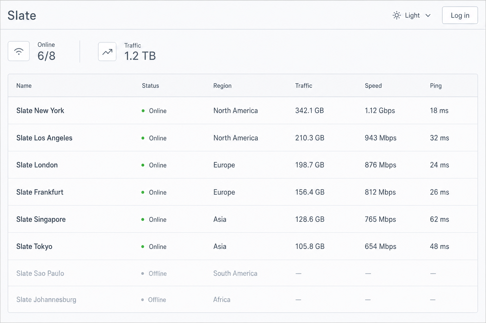

# Slate

Slate is a restrained [Komari](https://github.com/komari-monitor/komari) theme. The home page shows nodes in a table by default. It is built with **Vite**, **React**, **TypeScript**, **Tailwind CSS**, and **shadcn/ui**, then packaged as static assets you can upload as a Komari theme.

[中文](README-CN.md) · [Download theme](https://github.com/xkrfer/komari-theme-slate/releases/latest)

> This repository contains the frontend only. You need a running Komari backend. The recommended setup is to download the ZIP from Releases and upload it in the Komari admin dashboard.

> [!IMPORTANT]
> Requires **Komari >= 1.0.7** (RPC2). Older versions cannot load node data.



## Features

- Live dashboard: online / offline counts, total traffic, and current network speed
- Three home views: table, cards, and map (table on desktop by default, cards on mobile)
- Table view: name, status, OS icon, uptime, CPU / memory / disk usage, live speed
- Card view: region flag, IPv4 / IPv6 tags, days until expiry, renewal price, traffic and resource usage
- Map view: nodes grouped by region; click through to an instance
- Node search, group filter, and sorting (name / status / region / uptime / CPU / memory / disk / speed)
- Instance detail: overview, hardware, live metrics; load and ping charts; live / 1 day / 7 days / 30 days; ping peak clipping
- Admin sign-in with optional 2FA, then a shortcut into the Komari admin console
- Simplified Chinese / English; light / dark / system appearance
- Theme settings managed in the Komari admin panel, applied on a visitor's first visit
- ZIP packaging and GitHub Release workflow for Komari's theme system

## Tech stack

- **Build:** Vite 8 (`/api` proxy in development, static output to `dist/` in production)
- **Language:** TypeScript, React 19
- **Routing / data:** TanStack Router, TanStack Query, TanStack Table
- **UI:** shadcn/ui (Base UI), Tailwind CSS v4, Lucide
- **Charts / map:** ECharts, TopoJSON
- **Validation:** Zod
- **Package manager:** pnpm

In production, node status is refreshed about every 2 seconds over a WebSocket to `/api/rpc2`, with HTTP polling as fallback. In development the Vite proxy does not forward WebSocket, so status always uses HTTP polling.

## Prerequisites

- **Node.js** 22 or newer (CI uses 24)
- **pnpm** 10 (pinned via `packageManager`)
- A reachable **Komari >= 1.0.7** backend

## Install

1. Download `komari-theme-slate-v*.zip` from [Releases](https://github.com/xkrfer/komari-theme-slate/releases/latest), or run `pnpm package` locally.
2. Upload the ZIP in the Komari admin dashboard and enable **Slate**.
3. Optionally adjust the default appearance and visitor default view in theme settings.

The ZIP contains:

```text
komari-theme.json
preview.png
dist/
```

## Development

Use pnpm only. After cloning:

```bash
pnpm install
cp .env.example .env
pnpm dev
```

Then open `http://localhost:5173`.

### API target

The dev server proxies `/api` to the Komari backend. Set this in `.env` at the repo root:

```env
VITE_API_TARGET=http://127.0.0.1:25774
VITE_THEME_VERSION=0.1.0
```

Point `VITE_API_TARGET` at your Komari instance.

## Environment variables

| Variable | Description | Default |
| --- | --- | --- |
| `VITE_API_TARGET` | Komari backend URL used by the dev proxy | `http://127.0.0.1:25774` |
| `VITE_THEME_VERSION` | Theme version shown in the footer and used when packaging; must match `version` in `komari-theme.json` | `version` in `komari-theme.json` |

These are for local development and packaging only. After the theme is deployed on Komari, the browser calls `/api/rpc2` and `/api/login` on the current site.

## Theme settings

`komari-theme.json` declares settings managed in the Komari admin panel:

| Group | Settings |
| --- | --- |
| General | Default appearance, view, language, node sort, and sort direction |
| Home page | Summary cards and map view |
| Node list | Tags, billing, resource totals, network traffic, Swap, uptime, and its refresh interval |
| Guest display | Prices and expiration status |

Visitor choices for appearance, language, view, and node sorting are stored locally (`appearance`, `language`, `slate:view`, `slate:sort`, `slate:sort-direction`) and take priority on later visits. Without a stored sort preference, nodes are displayed using the admin-managed default immediately. Guest prices and expiration status are hidden by default; signed-in users are unaffected by those two settings. Disabling the map automatically falls back from a stored map view to an available view.

## Build and package

```bash
pnpm build
pnpm package
```

`pnpm build` writes the static site to `dist/`. `pnpm package` checks that `komari-theme.json`, `preview.png`, `dist/index.html`, and the version numbers match, then writes:

```text
komari-theme-slate-v{version}.zip
```

Husky + lint-staged run Biome before each commit. You can also run:

```bash
pnpm typecheck
pnpm lint
pnpm format
```

## Release

Use the GitHub Actions workflow **Release theme** (`workflow_dispatch`):

1. Run the workflow from the repository Actions tab.
2. Enter a SemVer value without the `v` prefix, for example `0.1.0` or `0.2.0-beta.1`.
3. The workflow validates the version, runs typecheck / lint, builds and packages the theme, then creates a GitHub Release with the ZIP attached. Versions that contain `-` are marked as pre-release.

## Scripts

| Command | Description |
| --- | --- |
| `pnpm dev` | Start the Vite dev server |
| `pnpm build` | Build static assets into `dist/` |
| `pnpm preview` | Preview the production build |
| `pnpm package` | Build and package the theme ZIP |
| `pnpm typecheck` | TypeScript type check |
| `pnpm lint` | Biome check |
| `pnpm format` | Biome format and fix |

## Acknowledgements

UI and interaction draw from:

- [nezha-dash](https://github.com/hamster1963/nezha-dash) — information density and table layout of the Nezha dashboard
- [komari-next](https://github.com/tonyliuzj/komari-next) — Komari theme packaging, map view, card billing details, and instance detail structure

The backend is [Komari](https://github.com/komari-monitor/komari).

## License

[MIT](LICENSE) © DouDou
